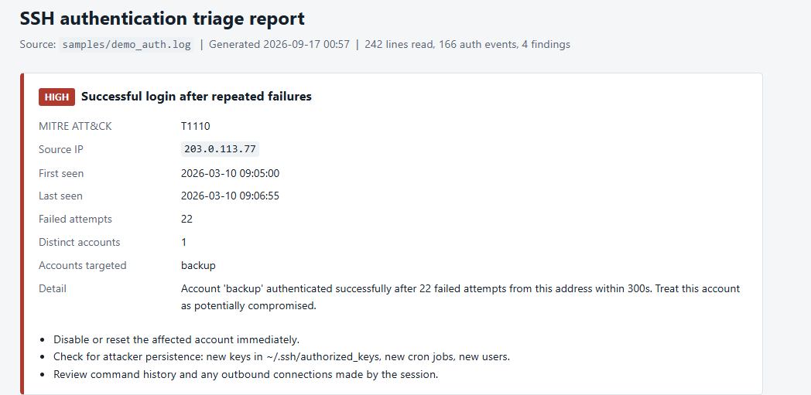

# SSH Log Triage

A command-line tool that reads a Linux `auth.log` and reports SSH credential attacks — brute force, password spraying, and successful logins that follow a run of failures — as a ranked, analyst-readable report.





## Quickstart

No third-party runtime dependencies — Python 3.9+ and the standard library.

```bash
git clone https://github.com/PiePop/ssh-log-triage.git
cd ssh-log-triage

python tools/make_sample_log.py --out samples/demo_auth.log   # synthetic test data
python cli.py samples/demo_auth.log                            # console report
python cli.py samples/demo_auth.log --html out/report.html --csv out/findings.csv
```

Against a real host:

```bash
sudo python cli.py /var/log/auth.log --year 2026 --threshold 15 --window 120
```

## What it detects

| Detection | Logic | ATT&CK |
|---|---|---|
| Brute-force attempts | A source IP exceeds *N* failed logins inside a sliding *W*-second window | [T1110](https://attack.mitre.org/techniques/T1110/) |
| Password spraying | One source IP tries many distinct accounts with only a few attempts each, staying under volume thresholds | [T1110.003](https://attack.mitre.org/techniques/T1110/003/) |
| Successful login after failures | An `Accepted` event from an IP that produced 5+ failures in the preceding 300 seconds — the highest-severity finding, because it may mean the host is already compromised | T1110 |

Every threshold is a CLI flag, because the right value depends entirely on the environment.

## Options

```
positional arguments:
  logfile               path to auth.log (plain text or .gz)

options:
  --year YEAR           year to assume, since syslog timestamps omit it
  --threshold N         failed logins inside the window before an IP is flagged (default: 10)
  --window SECONDS      sliding window (default: 60)
  --spray-users N       distinct accounts that make a source look like a sprayer (default: 8)
  --spray-attempts N    max attempts per account for spray classification (default: 4)
  --compromise-window S seconds before a success to look back for failures (default: 300)
  --csv PATH            write findings to CSV
  --html PATH           write a self-contained HTML report
  --quiet               suppress console output
```

Exit code is `1` when any high-severity finding is present, `0` otherwise, so the tool drops into a pipeline cleanly.

## Sample output

```
========================================================================
SSH AUTHENTICATION TRIAGE REPORT
========================================================================
Lines read: 242   Auth events parsed: 166   Ignored: 76
Findings: 4 (1 high, 3 medium)

[1] HIGH   Successful login after repeated failures  (T1110)
    Source IP      : 203.0.113.77
    Window         : 2026-03-10 09:05:00 -> 2026-03-10 09:06:55
    Failed attempts: 22   Distinct accounts: 1
    Accounts       : backup
    Detail         : Account 'backup' authenticated successfully after 22 failed
                     attempts from this address within 300s.
      - Disable or reset the affected account immediately.
      - Check for attacker persistence: new keys in ~/.ssh/authorized_keys, new cron jobs, new users.
      - Review command history and any outbound connections made by the session.
```

Full rendered examples: [`docs/sample-report.html`](docs/sample-report.html) and [`docs/sample-findings.csv`](docs/sample-findings.csv).

## How it works

`src/parser.py` streams the file one line at a time with a regex per event type, so memory use is flat regardless of file size and gzipped archives work without decompressing to disk. Roughly 100k lines/second on a laptop — a one-million-line log finishes in about ten seconds.

`src/detections.py` consumes those events incrementally. Each source address keeps a bounded deque of recent failure timestamps, trimmed as newer events arrive, so the burst check is a short scan from the newest entry rather than a pass over the whole history. The deque is capped as well, which keeps behaviour sane on logs containing thousands of duplicate timestamps.

Spray detection deliberately runs *instead of* the burst rule rather than alongside it: an attacker who spreads a few attempts across many accounts never trips a volume threshold, so the two rules describe different behaviours and should not both fire for the same source.

## Limitations

- Syslog timestamps carry no year. The tool assumes one (`--year`); logs spanning a new-year boundary will misorder events across it.
- OpenSSH log format only. Other SSH daemons and JSON-formatted logs are not parsed.
- Thresholds are heuristics. Untuned, a broken backup script retrying a stale credential will look like a brute-force attempt.
- Per-IP windows will not catch a distributed attack where each address tries only twice; that needs per-account aggregation instead.
- Log lines below the point of collection can be forged or dropped by an attacker with root. This tool trusts its input.

## Tests

```bash
python -m pytest -q          # with pytest installed
python tests/test_detections.py   # no dependencies
```

Ten tests cover timestamp padding, malformed lines, the burst threshold, benign slow failures, spray classification, and the compromise chain.

## Repository layout

```
cli.py                      entry point and argument parsing
src/parser.py               streaming auth.log parser
src/detections.py           sliding-window detection engine
src/report.py               console, CSV, and HTML rendering
tools/make_sample_log.py    synthetic log generator (safe to publish)
samples/demo_auth.log       generated demo data
tests/test_detections.py    test suite
docs/                       rendered sample outputs
```

## License

MIT — see [LICENSE](LICENSE).
